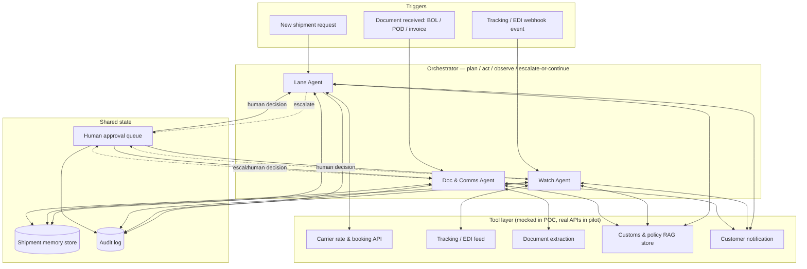

# System architecture

## Design principles

1. **One orchestration pattern, three agents.** Each agent follows the same
   plan → act → observe → escalate-or-continue loop, with its own tools and guardrail thresholds.
   This keeps the system legible — a reviewer (or a future engineer) only has to understand the
   pattern once.
2. **Shared memory, not siloed agents.** All three agents read and write the same per-shipment
   record. A discrepancy the Doc Agent finds is visible context for the Watch Agent's next
   diagnosis — they're one system watching one shipment, not three bots that happen to share a
   database.
3. **One approval queue.** Every escalation from every agent lands in the same human queue with a
   consistent shape (option(s), rationale, cost/risk delta) so an ops person doesn't have to
   context-switch between three different UIs to do their job.
4. **Everything is logged before it's autonomous.** The audit log is not an afterthought bolted on
   before launch — it's how thresholds get tuned in the Next phase and how a non-engineer verifies
   the system is behaving as expected (`docs/EVALS.md`).
5. **Mocked tools have a named real-world counterpart.** Nothing in the prototype is a fake
   capability invented for the demo — every mocked tool call in `prototype/index.html` maps to a
   specific real integration point listed in `docs/AGENTS.md`, so the path from POC to pilot is a
   list of integrations, not a redesign.

## What changes between POC and pilot

| Layer | POC (this repo) | Pilot (Next phase) |
|---|---|---|
| Tools | Fixture JSON, deterministic | Real TMS/carrier/EDI APIs |
| Memory | In-browser mock state | Persistent shipment DB |
| RAG | Static excerpts | Real vector store over the account's actual policy/customs docs |
| Guardrail thresholds | Illustrative defaults | Tuned against real human approve/reject decisions |
| Auto-execution | None — every action is shown, nothing is silently automatic | Only guardrail-cleared paths, per `docs/ROADMAP.md` |
